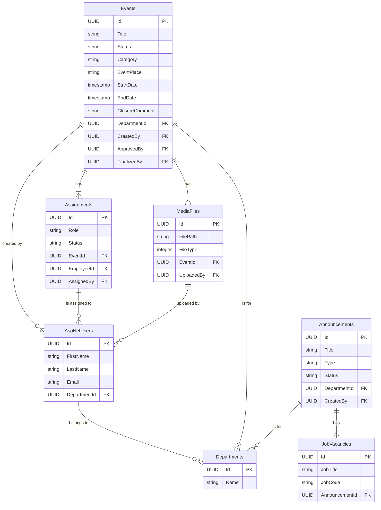

# EEP Event Management System – Entity-Relationship Diagram

This document provides a detailed overview of the database schema, generated from the final EF Core model snapshot. It represents the exact structure of the database.

---

## 1. Visual Diagram (Mermaid)

This diagram shows the primary relationships between the core entities. Note that `AspNetUsers` contains many more identity-related fields not shown here.

---

## 2. Table Definitions (PostgreSQL)

Column names reflect the `PascalCase` convention used by EF Core. All Primary and Foreign Keys are of type `uuid`.

### **AspNetUsers**
Managed by ASP.NET Identity. The fields below are the custom properties for this application.

| Field         | Data Type                 | Constraints      | Notes                               |
| ------------- | ------------------------- | ---------------- | ----------------------------------- |
| Id            | uuid                      | PK               |                                     |
| FirstName     | text                      | NOT NULL         |                                     |
| LastName      | text                      | NOT NULL         |                                     |
| EmployeeId    | text                      | NOT NULL         |                                     |
| Email         | character varying(256)    | NULLABLE         |                                     |
| DepartmentId  | uuid                      | FK → Departments(Id), NULL | User's department affiliation.      |
| ...           | ...                       | ...              | (Other ASP.NET Identity fields)     |

---

### **Departments**

| Field         | Data Type                 | Constraints                |
| ------------- | ------------------------- | -------------------------- |
| Id            | uuid                      | PK                         |
| Name          | character varying(100)    | NOT NULL, UNIQUE           |
| Description   | text                      | NULL                       |
| CreatedAt     | timestamp with time zone  | NOT NULL                   |
| UpdatedAt     | timestamp with time zone  | NOT NULL                   |

---

### **Events**

| Field                     | Data Type                 | Constraints                | Notes                                       |
| ------------------------- | ------------------------- | -------------------------- | ------------------------------------------- |
| Id                        | uuid                      | PK                         |                                             |
| Title                     | character varying(150)    | NOT NULL                   |                                             |
| Description               | text                      | NULL                       |                                             |
| Category                  | character varying(100)    | NOT NULL                   |                                             |
| DepartmentId              | uuid                      | FK → Departments(Id)       |                                             |
| EventPlace                | character varying(255)    | NULL                       | Physical address or online meeting URL.     |
| StartDate                 | timestamp with time zone  | NOT NULL                   |                                             |
| EndDate                   | timestamp with time zone  | NOT NULL                   |                                             |
| Status                    | character varying(20)     | NOT NULL, Default: 'Draft' | Enum: `Draft`, `Scheduled`, `Ongoing`, etc. |
| CoverImageUrl             | text                      | NULL                       |                                             |
| ClosureComment            | text                      | NULL                       | Comment added when an event is finalized.   |
| CancellationReason        | text                      | NULL                       |                                             |
| CancellationRequestStatus | character varying(20)     | NOT NULL, Default: 'None'  |                                             |
| ScheduleHistory           | text                      | NULL                       | Log of date/time changes.                   |
| CreatedBy                 | uuid                      | FK → AspNetUsers(Id)       |                                             |
| ApprovedBy                | uuid                      | FK → AspNetUsers(Id), NULL |                                             |
| FinalizedBy               | uuid                      | FK → AspNetUsers(Id), NULL |                                             |
| ...                       | ...                       | ...                        | (Other fields for cancellation/date change) |

---

### **Assignments**

| Field          | Data Type                 | Constraints      |
| -------------- | ------------------------- | ---------------- |
| Id             | uuid                      | PK               |
| EventId        | uuid                      | FK → Events(Id)  |
| EmployeeId     | uuid                      | FK → AspNetUsers(Id) |
| AssignedBy     | uuid                      | FK → AspNetUsers(Id) |
| Role           | character varying(20)     | NOT NULL         |
| Status         | character varying(20)     | NOT NULL         |
| DeclineReason  | text                      | NULL             |
| CommentHistory | text                      | NULL             |
| VerificationNote| text                     | NULL             |
| VerifiedAt     | timestamp with time zone  | NULL             |
| VerifiedById   | uuid                      | FK → AspNetUsers(Id), NULL |

---

### **MediaFiles**

| Field       | Data Type                 | Constraints      | Notes                                   |
| ----------- | ------------------------- | ---------------- | --------------------------------------- |
| Id          | uuid                      | PK               |                                         |
| EventId     | uuid                      | FK → Events(Id)  |                                         |
| UploadedBy  | uuid                      | FK → AspNetUsers(Id), NULL |                                         |
| FileType    | integer                   | NOT NULL         | Enum: `Image`, `Video`, `Document`, `Link`|
| FilePath    | character varying(1000)   | NULL             | URL for links or file path for uploads. |
| FileName    | character varying(500)    | NULL             |                                         |
| FileSize    | bigint                    | NOT NULL, Default: 0 | Size in bytes.                          |
| ThumbnailPath| character varying(1000)  | NULL             |                                         |

---

### **Announcements, JobVacancies, and Other Tables**
The database also includes tables for **Announcements**, **JobVacancies**, **Notifications**, and **AuditLogs** which follow similar `PascalCase` naming and `uuid` key conventions as detailed in the `ApplicationDbContextModelSnapshot.cs` file.
